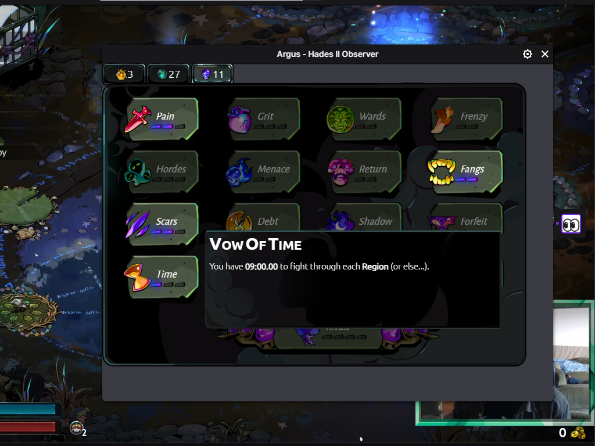

# Argus 👀 Twitch Extension

The Argus Twitch extension acts as an optional video component that shows viewers the current build in a `Hades II` run.

## Installation instructions

To start using the Argus Twitch extension just go to `Twitch → Creator Dashboard → Extensions → Discovery` and search for Argus. Once you have installed the extension, the configuration panel there will help you with the rest of the setup.

Most notably, you will need `Hades II` installed and the Argus 👀 mod. To install the mod, it is best to use a mod manager, and we recommend [r2modman](https://thunderstore.io/package/ebkr/r2modman/) since they are native to Thunderstore where we publish.

Once you have `r2modman`, just search for Argus in their list of `Hades II` mods. Installing the mod is as easy as clicking a button.

When you run the game with the mod installed for the first time, it will attempt to connect your Twitch account with Argus. The prompt **will appear in a browser window** while the game is starting up. We use this process to ensure that streamers can not be impersonated in our system.

That's it! You are ready to go!

You can test the extension before going live by opening your `Stream Manager` on Twitch and clicking on the Argus 👀 icon in your `Quick Actions`. A window will pop up showing what your viewers will see when you go live.

## How Argus Works

If you wish to dive deeper into how Argus works, you might want to look at two other relevant repositories:

- [Argus Backend](https://github.com/bmilojkovic/argus-h2-backend)
- [Argus Mod](https://github.com/bmilojkovic/argus-h2-mod)

The mod repository has a TECH_README that covers all the tech stuff in depth.
